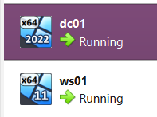
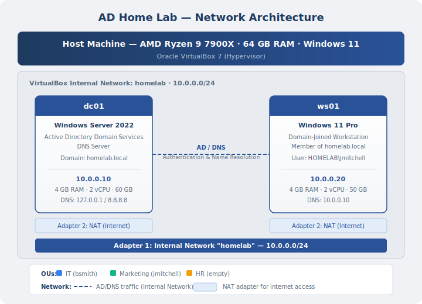
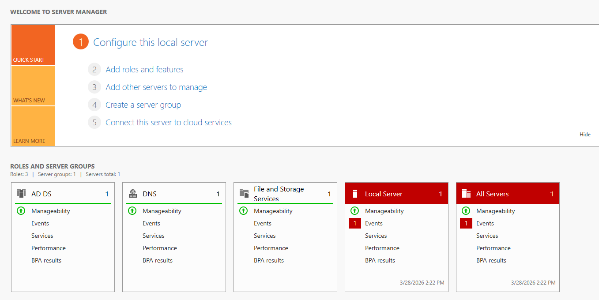
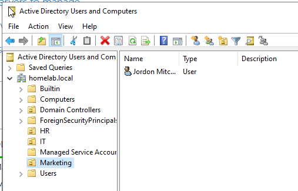
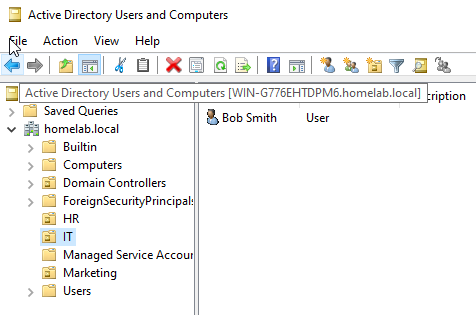
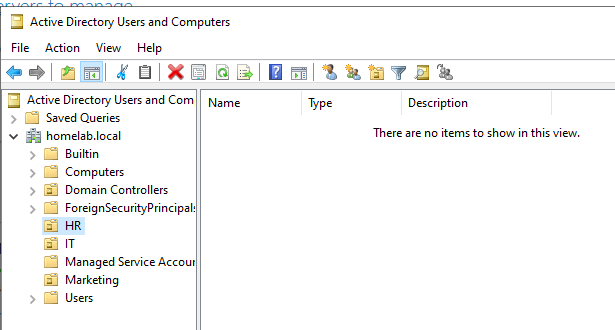
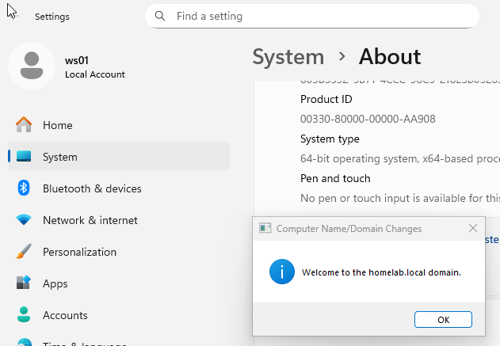
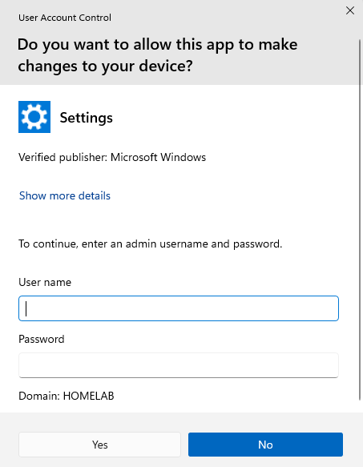
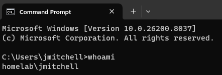

# Active Directory Lab

A hands-on virtualization lab built to practice the same IT support scenarios I'd handle on the job — user provisioning, domain management, and troubleshooting authentication issues in a Windows environment.

| | |
|---|---|
| **Type** | Infrastructure Lab |
| **Focus** | Active Directory, DNS, Domain Join, User Provisioning |
| **Status** | Complete — Expanding with Group Policy and Intune |
| **Environment** | VirtualBox on Windows 11, March 2026 |

---

## Overview

I built this lab to understand how Active Directory actually works under the hood. I needed a safe environment where I could create domain users, join workstations, break DNS on purpose, and fix it all without touching production. Every scenario I run here maps directly to a real help desk ticket: onboarding a new hire, troubleshooting a failed domain join, verifying DNS resolution across the network.

Lab overview — both VMs running in VirtualBox:

---

## Architecture

### Host Machine

| Component | Spec |
|-----------|------|
| CPU | AMD Ryzen 9 7900X (12-core) |
| RAM | 64 GB DDR5 |
| OS | Windows 11 |
| Hypervisor | Oracle VirtualBox 7 |

### Virtual Machines

| VM | OS | IP | Role |
|----|----|----|------|
| `dc01` | Windows Server 2022 | 10.0.0.10 | Domain Controller (AD DS + DNS) |
| `ws01` | Windows 11 Pro | 10.0.0.20 | Domain-joined workstation |

Both VMs are on static IPs — if dc01's address drifts, every machine on the domain loses DNS and authentication breaks. Static assignments also make firewall rules and troubleshooting predictable, which matters the moment something stops working.

### Network

Both VMs use a dual-adapter setup:

- **Adapter 1 — Internal Network (`homelab`):** All AD authentication, DNS queries, and inter-VM traffic on `10.0.0.0/24`. Isolates the lab from the host network, same concept as a VLAN in production.
- **Adapter 2 — NAT:** Internet access for Windows Updates and downloads without exposing the lab. In a real environment this would be a firewall rule or proxy — NAT achieves the same isolation at lab scale.

DNS is the piece that makes everything else work. `ws01` points to `dc01` (10.0.0.10) as its primary DNS server — without that, the workstation can't find `homelab.local`, and domain joins, authentication, and group policy all fail silently or with cryptic errors. `dc01` uses 127.0.0.1 for its own lookups and forwards external queries to 8.8.8.8 so both VMs can still reach the internet for updates.

Network diagram:

---

## Domain Setup

**Domain:** `homelab.local`

I installed both the AD DS and DNS Server roles on dc01 and promoted it to a domain controller. Both roles on the same box is standard for a small environment — DNS needs to be tightly coupled with AD because clients rely on SRV records to locate the domain controller. Splitting them across servers adds complexity without a benefit at this scale.

Server Manager on dc01 — AD DS and DNS roles installed:

### Organizational Units

| OU | Users | Purpose |
|----|-------|---------|
| IT | Bob Smith (`bsmith`) | IT department staff |
| Marketing | Jordan Mitchell (`jmitchell`) | Business-side employee |
| HR | *(empty)* | Pre-built for future onboarding scenarios |

I structured OUs by department because that's how Group Policy assignments typically break down — Marketing gets different drive mappings and desktop restrictions than IT. The empty HR OU is deliberate. Building it now means I can target policies to it later without restructuring anything, and it reflects how a real AD environment should be set up to scale before it needs to.

AD Users and Computers — Marketing OU with Jordan Mitchell:

AD Users and Computers — IT OU with Bob Smith:

AD Users and Computers — HR OU (empty, ready for future scenarios):

---

## Scenario: New Hire Onboarding

A new marketing hire, Jordan Mitchell, needs domain access on Day 1. This is the same workflow I'd run for any real onboarding ticket — create the account, verify it's configured correctly, test from the user's workstation, and confirm the login is actually authenticating against the domain.

### What I Did

**1. Created the AD account on dc01**

Opened Active Directory Users and Computers. Created `jmitchell` (Jordan Mitchell) in the Marketing OU — not the default Users container — because OU placement determines which Group Policies apply to the account. I set a temporary password and enabled "User must change password at next logon." That way the admin never knows the user's actual password, and the user sets their own credentials on first login. Standard onboarding practice.

**2. Verified the account before the user touched anything**

Before having Jordan try to log in, I confirmed the account was set up correctly: right OU, right display name, correct logon name (`jmitchell@homelab.local`), and the password-change flag enabled. Catching a misconfigured account at this stage is a lot faster than troubleshooting a failed login from the workstation after the user is already waiting.

**3. Tested domain login on ws01**

Switched to the workstation VM and logged in as `HOMELAB\jmitchell`. Behind the scenes, ws01 queried dc01 through DNS to find the domain controller, authenticated the credentials, and created a new user profile on the machine. That profile creation on first login is expected — it confirms the workstation is actually talking to AD and not just accepting cached credentials.

Domain join confirmation — "Welcome to homelab.local":

UAC prompt showing Domain: HOMELAB:

**4. Verified with `whoami`**

Opened Command Prompt and ran `whoami`. This is the fastest way to confirm the session is running as `homelab\jmitchell` and not a local account. Windows can cache local credentials, so a user might appear logged in but actually be on a local profile with the same name — which means no access to network resources, shared drives, or anything that requires domain authentication. `whoami` eliminates that ambiguity. On a real help desk call, this is the first thing I'd check.

Domain login proof — `whoami` showing `homelab\jmitchell`:

### Issues I Hit Along the Way

**VMs couldn't ping each other** — both were on NAT by default, which isolates each VM. Switched Adapter 1 to Internal Network and assigned static IPs.

**Firewall blocking ICMP** — Windows Firewall on dc01 was dropping ping requests. Enabled the "File and Printer Sharing (Echo Request - ICMPv4-In)" inbound rule.

**Domain join grayed out on ws01** — the workstation was running Windows 11 Home, which doesn't support domain joins. Reinstalled with Pro.

**DNS resolution failed** — ws01 was pointing to the NAT gateway for DNS instead of dc01. Manually set the primary DNS to 10.0.0.10. Without this, the workstation can't find `homelab.local` and the join fails with "domain could not be contacted."

### What I'd Document for Next Time

If this were a real environment, I'd template this onboarding workflow — OU placement, required group memberships, DNS verification on the workstation, and login confirmation steps. The goal is that the next person who onboards a user doesn't have to figure out the process from scratch. I'd also flag the DNS check as a mandatory pre-step before any domain join, since that's where most failures start.

---

## What This Taught Me

**DNS is the foundation of everything.** When `ws01` couldn't find the domain, the fix wasn't obvious until I worked through `nslookup`, checked which DNS server the workstation was actually using, and pointed it to dc01. That kind of layer-by-layer troubleshooting — checking one thing at a time instead of guessing — is exactly how you resolve "I can't log in" tickets in production.

**The pieces don't work in isolation.** AD needs DNS, workstations need to find AD through DNS, and the network topology determines whether any of it works at all. Breaking it and fixing it is where the understanding actually sticks.

**Building the lab is the easy part. Documenting it is the job.** Every decision — why static IPs, why department-based OUs, why DNS on the same box as the DC — has a reason. If I can't explain the reason, I don't understand the decision well enough.

---

## Tools & Technologies Used

| Tool | Purpose |
|------|---------|
| Oracle VirtualBox 7 | Hypervisor for running dc01 and ws01 |
| Windows Server 2022 (Eval) | Domain controller OS with AD DS and DNS |
| Windows 11 Pro | Domain-joined workstation |
| Active Directory Users and Computers | User and OU management |
| DNS Server (Windows) | Name resolution for the domain |
| Command Prompt / PowerShell | Verification and troubleshooting |

---

## Planned Additions

- **Group Policy** — Drive mappings by department, password policies, desktop configuration by OU.
- **Intune enrollment** — Enroll ws01 in Microsoft Intune using hybrid Azure AD join, adding cloud-based endpoint management alongside on-prem AD. Related: [Intune Helpdesk Case Study](https://github.com/DemRamenNoodles/intune-helpdesk-casestudy).
- **Okta AD Agent** — Sync on-prem AD users to Okta for cloud SSO, bridging on-prem identity with cloud identity management. Backed by Okta super badges: [Integrate with Active Directory](https://www.credly.com/badges/071f487b-973b-4e5d-8568-a475d2db2e61), [Implement MFA with Okta](https://www.credly.com/badges/011ca1cf-2d9b-40dd-aa66-ebbe8d89f17f), and [Manage Users and Groups](https://www.credly.com/badges/48f539e0-29f5-48e6-8a24-1e01cfd45170).

---

*Case Study — Lab Simulation — March 2026*
